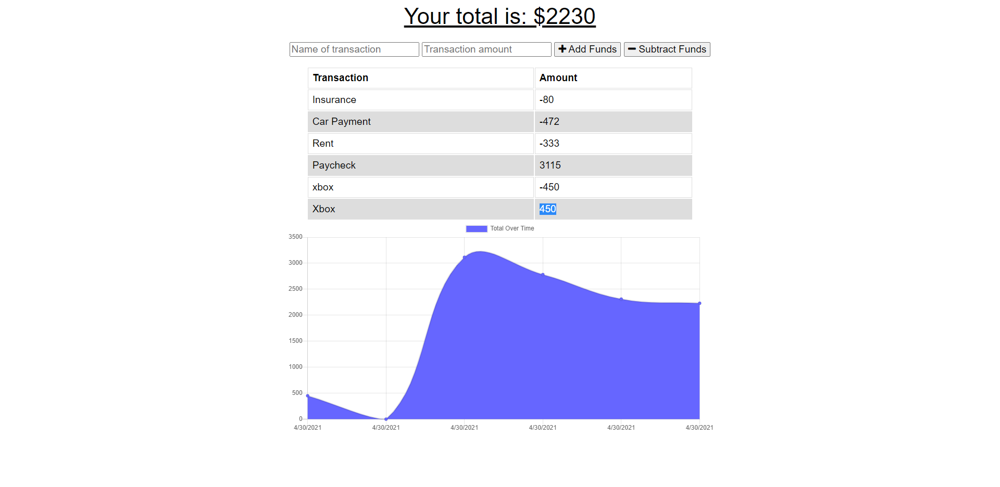

## Progressive Budget Tracker

## Table of Contents
- [Description](#description)
- [Installation](#installation)
- [Usage](#usage)
- [Questions](#questions)
- [Link](#link)
- [Screenshot](#screenshot)

## Description
The user will be able to add expenses and deposits to their budget with or without a connection. When entering transactions offline, they should populate the total when brought back online.

## Installation
- Clone repo to your pc.
- Input 'npm install'
- Input 'node server.js' into terminal

## Usage
```md
AS An avid traveller 
I WANT to be able to track my withdrawals and deposits with or without a data/internet connection 
SO THAT my account balance is accurate when I am traveling
```

## Questions 
Github: [codymichaud](https://github.com/codymichaud)  
Email: cody.r.michaud@gmail.com

## Link
Link to deployed web app [Progressive Budget Tracker](https://budget-tracker85.herokuapp.com/)

## Screenshot

